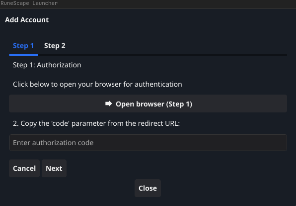
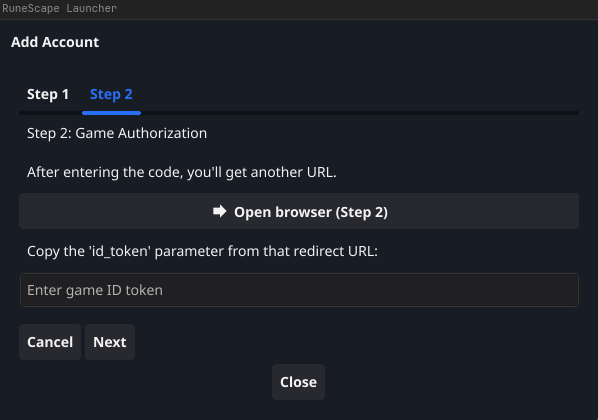
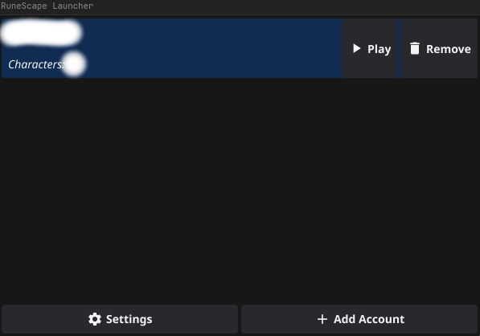
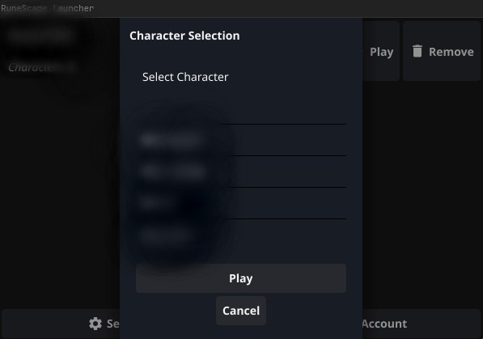

# Jagex OSRS Launcher

Cross-platform GUI launcher for OSRS that allows launching Runelite from different Jagex accounts. Built with Go and Fyne GUI.










## Why?
Jagex has made it clear that ["The Jagex launcher and Jagex Accounts will not be supported on the Linux OS"](https://help.jagex.com/hc/en-gb/articles/13413514881937). The only alternative is to use Wine. I don't want to use Wine.

Also, Jagex Launcher is intrusive and is constantly sending telemetry about your session.

## Getting Started

### Prerequisites

*   Go
*   A Jagex Account
*   RuneLite installed on your system.

### Building from Source

1.  **Clone the repository:**
    ```bash
    git clone https://github.com/rislah/jagex-launcher.git
    cd jagex-launcher
    ```
2.  **Build the application:**
    ```bash
    go build -o jagex-launcher .
    ```
